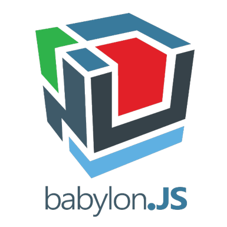

# ACOZMOZONE - Orby Ordbot ~ Save Marz!

Orby surfs space searching for his dad. Then he is captured by DarcBot! A bounty hunter bot, who brings the wayfairing space bot before the Emperor Zawd to cast judgement. At the SpacePalace, "You appear for the crime of free-surfing space. How do you plea?" > "Not guilty your honor. I believe in surfing freely." But when Zawd arrives he is in desperation! "Something dreadful happened on Marz. There is no time. Orby the ordinary robot, instead of condeming you, I Zawd grant you one freedom to choose: doorbot for life, or help me Save Marz from destruction? Choose." "Orby choose Save Marz"  "Ok then, Orby Dorbot, Go Save Marz!"

<adventure-music...>

<hr>

##TECH

Powered by:

[](https://www.babylonjs.com/)
BabylonJS
HTML5
jQuery


##CONTACTS

netcinematics@protonmail.com

@boxigon

# PWA Wrappables

Include PWA Wrappable App Pattern. 


## ~TITLESCREEN

Using a vanillaweb naming convention, we get aTitleScreen after instantiation. Like that? Its a little bit like inheriting from SplashScreen, but not. More like SEQUENCES. Many SEQUENCES evolve one another. It is a SEQUENCE of SEQUENCES. That is all. After SPLASHSCREEN completes, show lightning-fast TITLESCREEN, with user-interaction, and OPEN the media. Why???


 TITLESCREE


## HERO's JOURNEY

```
├── README.md
├── MIT-LICENSE
├── promo (app curation)
└── public
    ├── 3d (mesh)
    │   └── assets
    │   └── ...
    ├── img
    │   └── logos (separate from icons)
    │   └── ...
    ├── lib
    │   └── jquery (2D)
    │   └── babylon (3D)
    │   └── ...
    ├── sonic
    │   └── ... (AUDIO)
    ├── app.js
    ├── index.html
    ├── manifest.json
    └── sw.js (SERVICE-WORKER)
```


### PLATFORM NOTES

> Remote
  "scope": "/boxigonAppShell3/public/",
  "start_url": "/boxigonAppShell3/public/index.html?source=pwa",

> Default
  "scope": "/",
  "start_url": "/index.html?source=pwa",


> Debugging NODE run

node --inspect index.js

Then in chrome:   about://inspect

CLICK: Open dedicated DevTools for Node


html-minifier --collapse-whitespace --remove-comments --remove-optional-tags --remove-redundant-attributes --remove-script-type-attributes --remove-tag-whitespace --use-short-doctype --minify-css true --minify-js true ./index.max.html -o index.html


html-minifier --collapse-whitespace --remove-comments --remove-optional-tags --remove-redundant-attributes --remove-script-type-attributes --remove-tag-whitespace --use-short-doctype --minify-css true --minify-js true ./scene0.max.min.html -o scene0.min.html


npm install uglify-es -g
uglifyjs --compress --mangle  -o ./south.min.js -- ./south.js
